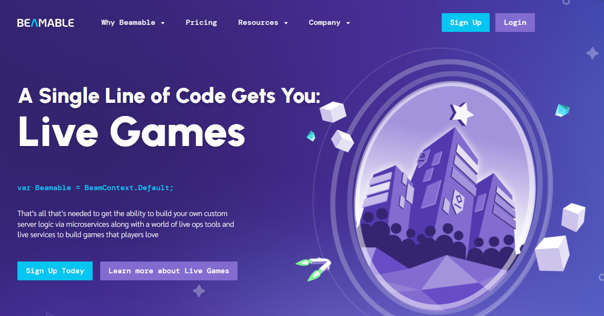

<div align="left">

[](https://beamable.com)

# [Beamable](https://beamable.com)

var Beamable = BeamContext.Default; - That one line of code is a gateway to everything you need to build custom server logic via microservices along with a world of LiveOps tools and live services to build games that players love.

</div>

## Requirements

Building the API client library requires:

1. Java 1.8+
2. Maven (3.8.3+)/Gradle (7.2+)

If you are adding this library to an Android Application or Library:

3. Android 8.0+ (API Level 26+)

## Installation<a id="installation"></a>
<div align="center">
  <a href="https://konfigthis.com/sdk-sign-up?company=Beamable&language=Java">
    
  </a>
</div>

### Maven users

Add this dependency to your project's POM:

```xml
<dependency>
  <groupId>com.konfigthis</groupId>
  <artifactId>beamable-java-sdk</artifactId>
  <version>1.0</version>
  <scope>compile</scope>
</dependency>
```

### Gradle users

Add this dependency to your `build.gradle`:

```groovy
// build.gradle
repositories {
  mavenCentral()
}

dependencies {
   implementation "com.konfigthis:beamable-java-sdk:1.0"
}
```

### Android users

Make sure your `build.gradle` file as a `minSdk` version of at least 26:
```groovy
// build.gradle
android {
    defaultConfig {
        minSdk 26
    }
}
```

Also make sure your library or application has internet permissions in your `AndroidManifest.xml`:

```xml
<!--AndroidManifest.xml-->
<?xml version="1.0" encoding="utf-8"?>
<manifest xmlns:android="http://schemas.android.com/apk/res/android"
    xmlns:tools="http://schemas.android.com/tools">
    <uses-permission android:name="android.permission.INTERNET"/>
</manifest>
```

### Others

At first generate the JAR by executing:

```shell
mvn clean package
```

Then manually install the following JARs:

* `target/beamable-java-sdk-1.0.jar`
* `target/lib/*.jar`

## Getting Started

Please follow the [installation](#installation) instruction and execute the following Java code:

```java
import com.konfigthis.client.ApiClient;
import com.konfigthis.client.ApiException;
import com.konfigthis.client.ApiResponse;
import com.konfigthis.client.Beamable;
import com.konfigthis.client.Configuration;
import com.konfigthis.client.auth.*;
import com.konfigthis.client.model.*;
import com.konfigthis.client.api.AccountApi;
import java.util.List;
import java.util.Map;
import java.util.UUID;

public class Example {
  public static void main(String[] args) {
    Configuration configuration = new Configuration();
    configuration.host = "https://api.beamable.com";
    
    configuration.scope  = "YOUR API KEY";
    Beamable client = new Beamable(configuration);
    String deviceId = "deviceId_example";
    try {
      AccountAvailableResponse result = client
              .account
              .checkAvailability(deviceId)
              .execute();
      System.out.println(result);
      System.out.println(result.getAvailable());
    } catch (ApiException e) {
      System.err.println("Exception when calling AccountApi#checkAvailability");
      System.err.println("Status code: " + e.getStatusCode());
      System.err.println("Reason: " + e.getResponseBody());
      System.err.println("Response headers: " + e.getResponseHeaders());
      e.printStackTrace();
    }

    // Use .executeWithHttpInfo() to retrieve HTTP Status Code, Headers and Request
    try {
      ApiResponse<AccountAvailableResponse> response = client
              .account
              .checkAvailability(deviceId)
              .executeWithHttpInfo();
      System.out.println(response.getResponseBody());
      System.out.println(response.getResponseHeaders());
      System.out.println(response.getStatusCode());
      System.out.println(response.getRoundTripTime());
      System.out.println(response.getRequest());
    } catch (ApiException e) {
      System.err.println("Exception when calling AccountApi#checkAvailability");
      System.err.println("Status code: " + e.getStatusCode());
      System.err.println("Reason: " + e.getResponseBody());
      System.err.println("Response headers: " + e.getResponseHeaders());
      e.printStackTrace();
    }
  }
}

```

## Documentation for API Endpoints

All URIs are relative to *https://api.beamable.com*

Class | Method | HTTP request | Description
------------ | ------------- | ------------- | -------------
*AccountApi* | [**checkAvailability**](docs/AccountApi.md#checkAvailability) | **GET** /basic/accounts/available/device-id | 
*AccountApi* | [**checkAvailability_0**](docs/AccountApi.md#checkAvailability_0) | **GET** /basic/accounts/available | 
*AccountApi* | [**checkThirdPartyAvailability**](docs/AccountApi.md#checkThirdPartyAvailability) | **GET** /basic/accounts/available/third-party | 
*AccountApi* | [**createAdminUser**](docs/AccountApi.md#createAdminUser) | **POST** /basic/accounts/admin/admin-user | 
*AccountApi* | [**deleteAdminScope**](docs/AccountApi.md#deleteAdminScope) | **DELETE** /object/accounts/{objectId}/admin/scope | 
*AccountApi* | [**deleteThirdParty**](docs/AccountApi.md#deleteThirdParty) | **DELETE** /basic/accounts/me/third-party | 
*AccountApi* | [**deleteThirdPartyAdmin**](docs/AccountApi.md#deleteThirdPartyAdmin) | **DELETE** /object/accounts/{objectId}/admin/third-party | 
*AccountApi* | [**findAccounts**](docs/AccountApi.md#findAccounts) | **GET** /basic/accounts/find | 
*AccountApi* | [**getAdminUsers**](docs/AccountApi.md#getAdminUsers) | **GET** /basic/accounts/admin/admin-users | 
*AccountApi* | [**getDetails**](docs/AccountApi.md#getDetails) | **GET** /basic/accounts/admin/me | 
*AccountApi* | [**getObjectAvailableRoles**](docs/AccountApi.md#getObjectAvailableRoles) | **GET** /object/accounts/{objectId}/available-roles | 
*AccountApi* | [**getPersonallyIdentifiableInformation**](docs/AccountApi.md#getPersonallyIdentifiableInformation) | **GET** /basic/accounts/get-personally-identifiable-information | 
*AccountApi* | [**getUserInfo**](docs/AccountApi.md#getUserInfo) | **GET** /basic/accounts/me | 
*AccountApi* | [**listRoles**](docs/AccountApi.md#listRoles) | **GET** /basic/history/account/roles | 
*AccountApi* | [**registerNewAccount**](docs/AccountApi.md#registerNewAccount) | **POST** /basic/accounts/register | 
*AccountApi* | [**removeAdminForget**](docs/AccountApi.md#removeAdminForget) | **DELETE** /object/accounts/{objectId}/admin/forget | 
*AccountApi* | [**removeDevice**](docs/AccountApi.md#removeDevice) | **DELETE** /basic/accounts/me/device | 
*AccountApi* | [**removeRole**](docs/AccountApi.md#removeRole) | **DELETE** /object/accounts/{objectId}/role | 
*AccountApi* | [**searchAccounts**](docs/AccountApi.md#searchAccounts) | **GET** /basic/accounts/search | 
*AccountApi* | [**updateAccountInfo**](docs/AccountApi.md#updateAccountInfo) | **PUT** /basic/accounts/me | 
*AccountApi* | [**updateAdminScope**](docs/AccountApi.md#updateAdminScope) | **PUT** /object/accounts/{objectId}/admin/scope | 
*AccountApi* | [**updatePasswordConfirmation**](docs/AccountApi.md#updatePasswordConfirmation) | **POST** /basic/accounts/password-update/confirm | 
*AccountApi* | [**updatePasswordInit**](docs/AccountApi.md#updatePasswordInit) | **POST** /basic/accounts/password-update/init | 
*AccountApi* | [**updateRole**](docs/AccountApi.md#updateRole) | **PUT** /object/accounts/{objectId}/role | 
*AccountApi* | [**updateThirdPartyAdmin**](docs/AccountApi.md#updateThirdPartyAdmin) | **PUT** /object/accounts/{objectId}/admin/third-party | 
*ActivityApi* | [**getRunningEvents**](docs/ActivityApi.md#getRunningEvents) | **GET** /basic/events/running | 
*AnnouncementApi* | [**claimObjectAnnouncement**](docs/AnnouncementApi.md#claimObjectAnnouncement) | **POST** /object/announcements/{objectId}/claim | 
*AnnouncementApi* | [**createNewAnnouncement**](docs/AnnouncementApi.md#createNewAnnouncement) | **POST** /basic/announcements | 
*AnnouncementApi* | [**deleteAnnouncement**](docs/AnnouncementApi.md#deleteAnnouncement) | **DELETE** /basic/announcements | 
*AnnouncementApi* | [**getAllAnnouncements**](docs/AnnouncementApi.md#getAllAnnouncements) | **GET** /basic/announcements/list | 
*AnnouncementApi* | [**getObjectDetails**](docs/AnnouncementApi.md#getObjectDetails) | **GET** /object/announcements/{objectId} | 
*AnnouncementApi* | [**getObjectRaw**](docs/AnnouncementApi.md#getObjectRaw) | **GET** /object/announcements/{objectId}/raw | 
*AnnouncementApi* | [**markAsRead**](docs/AnnouncementApi.md#markAsRead) | **PUT** /object/announcements/{objectId}/read | 
*AnnouncementApi* | [**removeAnnouncementObject**](docs/AnnouncementApi.md#removeAnnouncementObject) | **DELETE** /object/announcements/{objectId} | 
*AnnouncementApi* | [**searchOperation**](docs/AnnouncementApi.md#searchOperation) | **GET** /basic/announcements/search | 
*AuditApi* | [**getPaymentAudits**](docs/AuditApi.md#getPaymentAudits) | **GET** /basic/payments/audits | 
*AuthenticationApi* | [**getToken**](docs/AuthenticationApi.md#getToken) | **GET** /basic/auth/token | 
*AuthenticationApi* | [**requestToken**](docs/AuthenticationApi.md#requestToken) | **POST** /basic/auth/token | 
*AuthenticationApi* | [**steamPostAuth**](docs/AuthenticationApi.md#steamPostAuth) | **POST** /basic/payments/steam/auth | 
*BlockApi* | [**userSocialBlocked**](docs/BlockApi.md#userSocialBlocked) | **POST** /basic/social/blocked | 
*BlockApi* | [**userSocialUnblock**](docs/BlockApi.md#userSocialUnblock) | **DELETE** /basic/social/blocked | 
*CampaignApi* | [**createNewLegacyCloudCampaign**](docs/CampaignApi.md#createNewLegacyCloudCampaign) | **POST** /basic/legacy-cloud/campaigns | 
*CampaignApi* | [**getLegacyCloudCampaigns**](docs/CampaignApi.md#getLegacyCloudCampaigns) | **GET** /basic/legacy-cloud/campaigns | 
*CampaignApi* | [**removeLegacyCloud**](docs/CampaignApi.md#removeLegacyCloud) | **DELETE** /basic/legacy-cloud/campaigns | 
*CampaignApi* | [**updateSchedule**](docs/CampaignApi.md#updateSchedule) | **PUT** /basic/legacy-cloud/campaigns/schedule | 
*CloudsavingApi* | [**commitManifestPut**](docs/CloudsavingApi.md#commitManifestPut) | **PUT** /basic/cloudsaving/data/commitManifest | 
*CloudsavingApi* | [**deleteData**](docs/CloudsavingApi.md#deleteData) | **DELETE** /basic/cloudsaving/data | 
*CloudsavingApi* | [**getData**](docs/CloudsavingApi.md#getData) | **GET** /basic/cloudsaving | 
*CloudsavingApi* | [**getDataDownloadUrl**](docs/CloudsavingApi.md#getDataDownloadUrl) | **POST** /basic/cloudsaving/data/downloadURL | 
*CloudsavingApi* | [**getDataMetadata**](docs/CloudsavingApi.md#getDataMetadata) | **GET** /basic/cloudsaving/data/metadata | 
*CloudsavingApi* | [**moveDataPut**](docs/CloudsavingApi.md#moveDataPut) | **PUT** /basic/cloudsaving/data/move | 
*CloudsavingApi* | [**replaceData**](docs/CloudsavingApi.md#replaceData) | **POST** /basic/cloudsaving/data/replace | 
*CloudsavingApi* | [**uploadDataUrl**](docs/CloudsavingApi.md#uploadDataUrl) | **POST** /basic/cloudsaving/data/uploadURL | 
*CloudsavingApi* | [**uploadUrlFromPortal**](docs/CloudsavingApi.md#uploadUrlFromPortal) | **POST** /basic/cloudsaving/data/uploadURLFromPortal | 
*ContentApi* | [**applyContentData**](docs/ContentApi.md#applyContentData) | **POST** /basic/events/applyContent | 
*ContentApi* | [**checkManifestChecksum**](docs/ContentApi.md#checkManifestChecksum) | **GET** /basic/content/manifest/checksum | 
*ContentApi* | [**createManifestData**](docs/ContentApi.md#createManifestData) | **POST** /basic/content/manifest | 
*ContentApi* | [**createNewContent**](docs/ContentApi.md#createNewContent) | **POST** /basic/content | 
*ContentApi* | [**deleteEventContent**](docs/ContentApi.md#deleteEventContent) | **DELETE** /object/events/{objectId}/content | 
*ContentApi* | [**getAnnouncementContent**](docs/ContentApi.md#getAnnouncementContent) | **GET** /basic/announcements/content | 
*ContentApi* | [**getContentData**](docs/ContentApi.md#getContentData) | **GET** /basic/events/content | 
*ContentApi* | [**getContentDetails**](docs/ContentApi.md#getContentDetails) | **GET** /basic/content/content | 
*ContentApi* | [**getManifestData**](docs/ContentApi.md#getManifestData) | **GET** /basic/content/manifest | 
*ContentApi* | [**getPrivateManifest**](docs/ContentApi.md#getPrivateManifest) | **GET** /basic/content/manifest/private | 
*ContentApi* | [**getPublicManifest**](docs/ContentApi.md#getPublicManifest) | **GET** /basic/content/manifest/public | 
*ContentApi* | [**pullManifestData**](docs/ContentApi.md#pullManifestData) | **POST** /basic/content/manifest/pull | 
*ContentApi* | [**submitTextContent**](docs/ContentApi.md#submitTextContent) | **POST** /basic/content/text | 
*ContentApi* | [**updateObjectContent**](docs/ContentApi.md#updateObjectContent) | **PUT** /object/events/{objectId}/content | 
*CurrencyApi* | [**getInventoryCurrency**](docs/CurrencyApi.md#getInventoryCurrency) | **GET** /basic/inventory/currency | 
*EntitlementApi* | [**createLegacyEntitlementDefs**](docs/EntitlementApi.md#createLegacyEntitlementDefs) | **POST** /basic/legacy-entitlement-defs/grant | 
*EntitlementApi* | [**createLegacyEntitlementDefs_0**](docs/EntitlementApi.md#createLegacyEntitlementDefs_0) | **PUT** /basic/legacy-entitlement-defs | 
*EntitlementApi* | [**defineEntitlementLegacy**](docs/EntitlementApi.md#defineEntitlementLegacy) | **PUT** /basic/legacy-entitlement-defs/claim | 
*EntitlementApi* | [**getPlayerEntitlements**](docs/EntitlementApi.md#getPlayerEntitlements) | **GET** /basic/legacy-entitlement-defs/player | 
*EntitlementApi* | [**revokeLegacyEntitlementDefs**](docs/EntitlementApi.md#revokeLegacyEntitlementDefs) | **DELETE** /basic/legacy-entitlement-defs/revoke | 
*EntitlementApi* | [**uploadLegacyEntitlementDefs**](docs/EntitlementApi.md#uploadLegacyEntitlementDefs) | **POST** /basic/legacy-entitlement-defs/upload | 
*EventApi* | [**claimObjectEventPlayers**](docs/EventApi.md#claimObjectEventPlayers) | **POST** /object/event-players/{objectId}/claim | 
*EventApi* | [**getCalendarEvents**](docs/EventApi.md#getCalendarEvents) | **GET** /basic/events/calendar | 
*EventApi* | [**getObjectEvents**](docs/EventApi.md#getObjectEvents) | **GET** /object/events/{objectId} | 
*EventApi* | [**getPlayersData**](docs/EventApi.md#getPlayersData) | **GET** /object/event-players/{objectId} | 
*EventApi* | [**pingObjectEvents**](docs/EventApi.md#pingObjectEvents) | **GET** /object/events/{objectId}/ping | 
*EventApi* | [**refreshObjectEvents**](docs/EventApi.md#refreshObjectEvents) | **PUT** /object/events/{objectId}/refresh | 
*EventApi* | [**updateObjectEndPhase**](docs/EventApi.md#updateObjectEndPhase) | **PUT** /object/events/{objectId}/endPhase | 
*EventApi* | [**updatePlayerScore**](docs/EventApi.md#updatePlayerScore) | **PUT** /object/event-players/{objectId}/score | 
*FriendApi* | [**importFriendsData**](docs/FriendApi.md#importFriendsData) | **POST** /basic/social/friends/import | 
*FriendApi* | [**removeFriend**](docs/FriendApi.md#removeFriend) | **DELETE** /basic/social/friends | 
*GameApi* | [**createRealm**](docs/GameApi.md#createRealm) | **POST** /basic/realms/game | 
*GameApi* | [**getRealms**](docs/GameApi.md#getRealms) | **GET** /basic/realms/game | 
*GameApi* | [**getRealmsGames**](docs/GameApi.md#getRealmsGames) | **GET** /basic/realms/games | 
*GameApi* | [**postNotification**](docs/GameApi.md#postNotification) | **POST** /basic/notification/game | 
*GameApi* | [**relayObjectPost**](docs/GameApi.md#relayObjectPost) | **POST** /object/gamerelay/{objectId} | 
*GameApi* | [**relayObjectResults**](docs/GameApi.md#relayObjectResults) | **POST** /object/gamerelay/{objectId}/results | 
*GameApi* | [**relayObjectSync**](docs/GameApi.md#relayObjectSync) | **POST** /object/gamerelay/{objectId}/sync | 
*GameApi* | [**updateRealm**](docs/GameApi.md#updateRealm) | **PUT** /basic/realms/game | 
*GroupApi* | [**applyObjectGroups**](docs/GroupApi.md#applyObjectGroups) | **POST** /object/groups/{objectId}/apply | 
*GroupApi* | [**assignObjectGroup**](docs/GroupApi.md#assignObjectGroup) | **POST** /object/group-users/{objectId}/group | 
*GroupApi* | [**createDonation**](docs/GroupApi.md#createDonation) | **POST** /object/groups/{objectId}/donations | 
*GroupApi* | [**createPetition**](docs/GroupApi.md#createPetition) | **POST** /object/groups/{objectId}/petition | 
*GroupApi* | [**deleteObjectGroup**](docs/GroupApi.md#deleteObjectGroup) | **DELETE** /object/groups/{objectId} | 
*GroupApi* | [**getGroupUsers**](docs/GroupApi.md#getGroupUsers) | **GET** /object/group-users/{objectId} | 
*GroupApi* | [**getObjectGroups**](docs/GroupApi.md#getObjectGroups) | **GET** /object/groups/{objectId} | 
*GroupApi* | [**getRecommendedUsers**](docs/GroupApi.md#getRecommendedUsers) | **GET** /object/group-users/{objectId}/recommended | 
*GroupApi* | [**getUserAvailability**](docs/GroupApi.md#getUserAvailability) | **GET** /object/group-users/{objectId}/availability | 
*GroupApi* | [**inviteObjectGroup**](docs/GroupApi.md#inviteObjectGroup) | **POST** /object/groups/{objectId}/invite | 
*GroupApi* | [**joinUserDelete**](docs/GroupApi.md#joinUserDelete) | **DELETE** /object/group-users/{objectId}/join | 
*GroupApi* | [**joinUserToGroup**](docs/GroupApi.md#joinUserToGroup) | **POST** /object/group-users/{objectId}/join | 
*GroupApi* | [**kickObjectGroup**](docs/GroupApi.md#kickObjectGroup) | **POST** /object/groups/{objectId}/kick | 
*GroupApi* | [**removeMember**](docs/GroupApi.md#removeMember) | **DELETE** /object/groups/{objectId}/member | 
*GroupApi* | [**searchGroups**](docs/GroupApi.md#searchGroups) | **GET** /basic/groups/search | 
*GroupApi* | [**searchUsers**](docs/GroupApi.md#searchUsers) | **GET** /object/group-users/{objectId}/search | 
*GroupApi* | [**updateDonation**](docs/GroupApi.md#updateDonation) | **PUT** /object/groups/{objectId}/donations | 
*GroupApi* | [**updateObjectGroup**](docs/GroupApi.md#updateObjectGroup) | **PUT** /object/groups/{objectId} | 
*GroupApi* | [**updateRole**](docs/GroupApi.md#updateRole) | **PUT** /object/groups/{objectId}/role | 
*HistoryApi* | [**getApiAccessHistory**](docs/HistoryApi.md#getApiAccessHistory) | **GET** /basic/history/apiaccess | 
*HistoryApi* | [**getApiAccessUrl**](docs/HistoryApi.md#getApiAccessUrl) | **GET** /basic/history/apiaccess/url | 
*HistoryApi* | [**getEventHistory**](docs/HistoryApi.md#getEventHistory) | **GET** /basic/history/events | 
*HistoryApi* | [**getMicroservicesHistory**](docs/HistoryApi.md#getMicroservicesHistory) | **GET** /basic/history/microservices | 
*HistoryApi* | [**getQueryData**](docs/HistoryApi.md#getQueryData) | **POST** /basic/history/query/url | 
*HistoryApi* | [**getQueryResults**](docs/HistoryApi.md#getQueryResults) | **POST** /basic/history/query | 
*ItemApi* | [**listItems**](docs/ItemApi.md#listItems) | **GET** /basic/inventory/items | 
*LeaderboardApi* | [**createFreezeRequest**](docs/LeaderboardApi.md#createFreezeRequest) | **PUT** /object/leaderboards/{objectId}/freeze | 
*LeaderboardApi* | [**deleteEntries**](docs/LeaderboardApi.md#deleteEntries) | **DELETE** /object/leaderboards/{objectId}/entries | 
*LeaderboardApi* | [**deleteObjectById**](docs/LeaderboardApi.md#deleteObjectById) | **DELETE** /object/leaderboards/{objectId} | 
*LeaderboardApi* | [**getAssignmentLeaderboard**](docs/LeaderboardApi.md#getAssignmentLeaderboard) | **GET** /basic/leaderboards/assignment | 
*LeaderboardApi* | [**getObjectDetails**](docs/LeaderboardApi.md#getObjectDetails) | **GET** /object/leaderboards/{objectId}/details | 
*LeaderboardApi* | [**getObjectMatches**](docs/LeaderboardApi.md#getObjectMatches) | **GET** /object/leaderboards/{objectId}/matches | 
*LeaderboardApi* | [**getObjectMembership**](docs/LeaderboardApi.md#getObjectMembership) | **GET** /object/leaderboards/{objectId}/membership | 
*LeaderboardApi* | [**getObjectPartition**](docs/LeaderboardApi.md#getObjectPartition) | **GET** /object/leaderboards/{objectId}/partition | 
*LeaderboardApi* | [**getObjectView**](docs/LeaderboardApi.md#getObjectView) | **GET** /object/leaderboards/{objectId}/view | 
*LeaderboardApi* | [**getPlayerScores**](docs/LeaderboardApi.md#getPlayerScores) | **GET** /basic/leaderboards/player | 
*LeaderboardApi* | [**getUserScores**](docs/LeaderboardApi.md#getUserScores) | **GET** /basic/leaderboards/uid | 
*LeaderboardApi* | [**listObjectRanks**](docs/LeaderboardApi.md#listObjectRanks) | **GET** /object/leaderboards/{objectId}/ranks | 
*LeaderboardApi* | [**listUserScores**](docs/LeaderboardApi.md#listUserScores) | **GET** /basic/leaderboards/list | 
*LeaderboardApi* | [**removeAssignment**](docs/LeaderboardApi.md#removeAssignment) | **DELETE** /object/leaderboards/{objectId}/assignment | 
*LeaderboardApi* | [**removeEntry**](docs/LeaderboardApi.md#removeEntry) | **DELETE** /object/leaderboards/{objectId}/entry | 
*LeaderboardApi* | [**submitObjectScores**](docs/LeaderboardApi.md#submitObjectScores) | **POST** /object/leaderboards/{objectId} | 
*LeaderboardApi* | [**swapObjectLeaderboard**](docs/LeaderboardApi.md#swapObjectLeaderboard) | **PUT** /object/leaderboards/{objectId}/swap | 
*LeaderboardApi* | [**updateEntry**](docs/LeaderboardApi.md#updateEntry) | **PUT** /object/leaderboards/{objectId}/entry | 
*LegacyEntitlementDefApi* | [**createDefinition**](docs/LegacyEntitlementDefApi.md#createDefinition) | **POST** /basic/legacy-entitlement-defs | 
*LegacyPvpDefApi* | [**createOrUpdateDefinition**](docs/LegacyPvpDefApi.md#createOrUpdateDefinition) | **PUT** /basic/legacy-pvp-defs | 
*LegacyPvpDefApi* | [**deleteDefinition**](docs/LegacyPvpDefApi.md#deleteDefinition) | **DELETE** /basic/legacy-pvp-defs | 
*LegacyPvpDefApi* | [**deleteEntitlementDefinition**](docs/LegacyPvpDefApi.md#deleteEntitlementDefinition) | **DELETE** /basic/legacy-entitlement-defs | 
*LegacyPvpDefApi* | [**getDefinitions**](docs/LegacyPvpDefApi.md#getDefinitions) | **GET** /basic/legacy-pvp-defs | 
*LegacyPvpDefApi* | [**getEntitlementDefs**](docs/LegacyPvpDefApi.md#getEntitlementDefs) | **GET** /basic/legacy-entitlement-defs | 
*LegacyPvpDefApi* | [**submitPvpFile**](docs/LegacyPvpDefApi.md#submitPvpFile) | **POST** /basic/legacy-pvp-defs/file | 
*MailApi* | [**acceptMany**](docs/MailApi.md#acceptMany) | **PUT** /object/mail/{objectId}/accept/many | 
*MailApi* | [**createObjectMail**](docs/MailApi.md#createObjectMail) | **POST** /object/mail/{objectId} | 
*MailApi* | [**getMailTemplate**](docs/MailApi.md#getMailTemplate) | **GET** /basic/mail/template | 
*MailApi* | [**getMessages**](docs/MailApi.md#getMessages) | **GET** /basic/mail | 
*MailApi* | [**getObjectCategories**](docs/MailApi.md#getObjectCategories) | **GET** /object/mail/{objectId}/categories | 
*MailApi* | [**getObjectDetail**](docs/MailApi.md#getObjectDetail) | **GET** /object/mail/{objectId}/detail | 
*MailApi* | [**getObjectMail**](docs/MailApi.md#getObjectMail) | **GET** /object/mail/{objectId} | 
*MailApi* | [**searchMailObject**](docs/MailApi.md#searchMailObject) | **POST** /object/mail/{objectId}/search | 
*MailApi* | [**sendBulkEmails**](docs/MailApi.md#sendBulkEmails) | **POST** /basic/mail/bulk | 
*MailApi* | [**sendBulkItems**](docs/MailApi.md#sendBulkItems) | **POST** /object/mail/{objectId}/bulk | 
*MailApi* | [**updateAdminEmail**](docs/MailApi.md#updateAdminEmail) | **PUT** /object/accounts/{objectId}/admin/email | 
*MailApi* | [**updateEmailConfirmation**](docs/MailApi.md#updateEmailConfirmation) | **POST** /basic/accounts/email-update/confirm | 
*MailApi* | [**updateEmailInit**](docs/MailApi.md#updateEmailInit) | **POST** /basic/accounts/email-update/init | 
*MailApi* | [**updateMailContent**](docs/MailApi.md#updateMailContent) | **PUT** /basic/mail | 
*MailApi* | [**updateObjectBulk**](docs/MailApi.md#updateObjectBulk) | **PUT** /object/mail/{objectId}/bulk | 
*MailApi* | [**updateObjectMail**](docs/MailApi.md#updateObjectMail) | **PUT** /object/mail/{objectId} | 
*MailApi* | [**uploadAttachment**](docs/MailApi.md#uploadAttachment) | **PUT** /basic/mail/attachments | 
*MessageApi* | [**createLaunchMessage**](docs/MessageApi.md#createLaunchMessage) | **POST** /basic/realms/launch-message | 
*MessageApi* | [**deleteLaunchMessage**](docs/MessageApi.md#deleteLaunchMessage) | **DELETE** /basic/realms/launch-message | 
*MessageApi* | [**getLaunchData**](docs/MessageApi.md#getLaunchData) | **GET** /basic/realms/launch-message | 
*MessageApi* | [**getMySocialData**](docs/MessageApi.md#getMySocialData) | **GET** /basic/social/my | 
*MessageApi* | [**sendMessage**](docs/MessageApi.md#sendMessage) | **POST** /object/chatV2/{objectId}/messages | 
*MessageApi* | [**sendPushNotification**](docs/MessageApi.md#sendPushNotification) | **POST** /basic/push/send | 
*NotificationApi* | [**createCustomNotification**](docs/NotificationApi.md#createCustomNotification) | **POST** /basic/notification/custom | 
*NotificationApi* | [**getUnreadMessages**](docs/NotificationApi.md#getUnreadMessages) | **GET** /basic/notification | 
*NotificationApi* | [**sendGlobalNotification**](docs/NotificationApi.md#sendGlobalNotification) | **POST** /basic/notification/global | 
*NotificationApi* | [**sendNotification**](docs/NotificationApi.md#sendNotification) | **POST** /basic/notification/generic | 
*NotificationApi* | [**sendPlayerNotification**](docs/NotificationApi.md#sendPlayerNotification) | **POST** /basic/notification/player | 
*NotificationApi* | [**sendServerNotification**](docs/NotificationApi.md#sendServerNotification) | **POST** /basic/notification/server | 
*ObjectApi* | [**claimCalendar**](docs/ObjectApi.md#claimCalendar) | **POST** /object/calendars/{objectId}/claim | 
*ObjectApi* | [**createChatRoom**](docs/ObjectApi.md#createChatRoom) | **POST** /object/chatV2/{objectId}/rooms | 
*ObjectApi* | [**createCommerceCoupons**](docs/ObjectApi.md#createCommerceCoupons) | **POST** /object/commerce/{objectId}/coupons | 
*ObjectApi* | [**createInventoryObject**](docs/ObjectApi.md#createInventoryObject) | **POST** /object/inventory/{objectId} | 
*ObjectApi* | [**createObjectStats**](docs/ObjectApi.md#createObjectStats) | **POST** /object/stats/{objectId} | 
*ObjectApi* | [**deleteRoom**](docs/ObjectApi.md#deleteRoom) | **DELETE** /object/chatV2/{objectId}/rooms | 
*ObjectApi* | [**deleteStatsObject**](docs/ObjectApi.md#deleteStatsObject) | **DELETE** /object/stats/{objectId} | 
*ObjectApi* | [**deleteStatusById**](docs/ObjectApi.md#deleteStatusById) | **DELETE** /object/commerce/{objectId}/status | 
*ObjectApi* | [**getById**](docs/ObjectApi.md#getById) | **GET** /object/commerce/{objectId} | 
*ObjectApi* | [**getCalendars**](docs/ObjectApi.md#getCalendars) | **GET** /object/calendars/{objectId} | 
*ObjectApi* | [**getChatRooms**](docs/ObjectApi.md#getChatRooms) | **GET** /object/chatV2/{objectId}/rooms | 
*ObjectApi* | [**getChatV2**](docs/ObjectApi.md#getChatV2) | **GET** /object/chatV2/{objectId} | 
*ObjectApi* | [**getClientStats**](docs/ObjectApi.md#getClientStats) | **GET** /object/stats/{objectId}/client | 
*ObjectApi* | [**getCommerceCouponCount**](docs/ObjectApi.md#getCommerceCouponCount) | **GET** /object/commerce/{objectId}/coupons/count | 
*ObjectApi* | [**getCommerceListings**](docs/ObjectApi.md#getCommerceListings) | **GET** /object/commerce/{objectId}/listings | 
*ObjectApi* | [**getCommerceOffers**](docs/ObjectApi.md#getCommerceOffers) | **GET** /object/commerce/{objectId}/offers | 
*ObjectApi* | [**getInventoryObjectById**](docs/ObjectApi.md#getInventoryObjectById) | **GET** /object/inventory/{objectId} | 
*ObjectApi* | [**getMatchmakingData**](docs/ObjectApi.md#getMatchmakingData) | **GET** /object/matchmaking/{objectId}/match | 
*ObjectApi* | [**getMultipliers**](docs/ObjectApi.md#getMultipliers) | **GET** /object/inventory/{objectId}/multipliers | 
*ObjectApi* | [**getObjectStats**](docs/ObjectApi.md#getObjectStats) | **GET** /object/stats/{objectId} | 
*ObjectApi* | [**getOffersAdmin**](docs/ObjectApi.md#getOffersAdmin) | **GET** /object/commerce/{objectId}/offersAdmin | 
*ObjectApi* | [**getPaymentDetails**](docs/ObjectApi.md#getPaymentDetails) | **GET** /object/payments/{objectId} | 
*ObjectApi* | [**matchmakingDelete**](docs/ObjectApi.md#matchmakingDelete) | **DELETE** /object/matchmaking/{objectId}/match | 
*ObjectApi* | [**postClientStats**](docs/ObjectApi.md#postClientStats) | **POST** /object/stats/{objectId}/client | 
*ObjectApi* | [**postClientStringlist**](docs/ObjectApi.md#postClientStringlist) | **POST** /object/stats/{objectId}/client/stringlist | 
*ObjectApi* | [**purchaseById**](docs/ObjectApi.md#purchaseById) | **PUT** /object/commerce/{objectId}/purchase | 
*ObjectApi* | [**purchaseItem**](docs/ObjectApi.md#purchaseItem) | **POST** /object/commerce/{objectId}/purchase | 
*ObjectApi* | [**removeTransactionById**](docs/ObjectApi.md#removeTransactionById) | **DELETE** /object/inventory/{objectId}/transaction | 
*ObjectApi* | [**startMatchmakingProcess**](docs/ObjectApi.md#startMatchmakingProcess) | **POST** /object/matchmaking/{objectId}/match | 
*ObjectApi* | [**transferItemInventory**](docs/ObjectApi.md#transferItemInventory) | **PUT** /object/inventory/{objectId}/transfer | 
*ObjectApi* | [**updateInventoryObject**](docs/ObjectApi.md#updateInventoryObject) | **PUT** /object/inventory/{objectId} | 
*ObjectApi* | [**updateInventoryPreview**](docs/ObjectApi.md#updateInventoryPreview) | **PUT** /object/inventory/{objectId}/preview | 
*ObjectApi* | [**updateMatchmakingTick**](docs/ObjectApi.md#updateMatchmakingTick) | **PUT** /object/matchmaking/{objectId}/tick | 
*ObjectApi* | [**updateStatObject**](docs/ObjectApi.md#updateStatObject) | **POST** /object/commerce/{objectId}/stats/update | 
*OrderApi* | [**getSteam**](docs/OrderApi.md#getSteam) | **GET** /basic/payments/steam/order | 
*PaymentApi* | [**cancelPurchase**](docs/PaymentApi.md#cancelPurchase) | **POST** /basic/payments/test/purchase/cancel | 
*PaymentApi* | [**cancelPurchaseProcess**](docs/PaymentApi.md#cancelPurchaseProcess) | **POST** /basic/payments/itunes/purchase/cancel | 
*PaymentApi* | [**completeItunesPurchase**](docs/PaymentApi.md#completeItunesPurchase) | **POST** /basic/payments/itunes/purchase/complete | 
*PaymentApi* | [**completePurchase**](docs/PaymentApi.md#completePurchase) | **POST** /basic/payments/test/purchase/complete | 
*PaymentApi* | [**completePurchaseProcess**](docs/PaymentApi.md#completePurchaseProcess) | **POST** /basic/payments/googleplay/purchase/complete | 
*PaymentApi* | [**completePurchase_0**](docs/PaymentApi.md#completePurchase_0) | **POST** /basic/payments/coupon/purchase/complete | 
*PaymentApi* | [**couponPurchaseBegin**](docs/PaymentApi.md#couponPurchaseBegin) | **POST** /basic/payments/coupon/purchase/begin | 
*PaymentApi* | [**couponPurchaseCancel**](docs/PaymentApi.md#couponPurchaseCancel) | **POST** /basic/payments/coupon/purchase/cancel | 
*PaymentApi* | [**facebookPurchaseBegin**](docs/PaymentApi.md#facebookPurchaseBegin) | **POST** /basic/payments/facebook/purchase/begin | 
*PaymentApi* | [**facebookPurchaseCancel**](docs/PaymentApi.md#facebookPurchaseCancel) | **POST** /basic/payments/facebook/purchase/cancel | 
*PaymentApi* | [**facebookPurchaseComplete**](docs/PaymentApi.md#facebookPurchaseComplete) | **POST** /basic/payments/facebook/purchase/complete | 
*PaymentApi* | [**facebookPurchaseFailure**](docs/PaymentApi.md#facebookPurchaseFailure) | **POST** /basic/payments/facebook/purchase/fail | 
*PaymentApi* | [**failPurchase**](docs/PaymentApi.md#failPurchase) | **POST** /basic/payments/coupon/purchase/fail | 
*PaymentApi* | [**googlePlayPurchaseBegin**](docs/PaymentApi.md#googlePlayPurchaseBegin) | **POST** /basic/payments/googleplay/purchase/begin | 
*PaymentApi* | [**googlePlayPurchaseCancel**](docs/PaymentApi.md#googlePlayPurchaseCancel) | **POST** /basic/payments/googleplay/purchase/cancel | 
*PaymentApi* | [**initializePurchaseProcess**](docs/PaymentApi.md#initializePurchaseProcess) | **POST** /basic/payments/windows/purchase/begin | 
*PaymentApi* | [**itunesPurchaseBegin**](docs/PaymentApi.md#itunesPurchaseBegin) | **POST** /basic/payments/itunes/purchase/begin | 
*PaymentApi* | [**itunesPurchaseTrack**](docs/PaymentApi.md#itunesPurchaseTrack) | **POST** /basic/payments/itunes/purchase/track | 
*PaymentApi* | [**processBegin**](docs/PaymentApi.md#processBegin) | **POST** /basic/payments/test/purchase/begin | 
*PaymentApi* | [**processComplete**](docs/PaymentApi.md#processComplete) | **POST** /basic/payments/windows/purchase/complete | 
*PaymentApi* | [**processFailure**](docs/PaymentApi.md#processFailure) | **POST** /basic/payments/itunes/purchase/fail | 
*PaymentApi* | [**processFailure_0**](docs/PaymentApi.md#processFailure_0) | **POST** /basic/payments/test/purchase/fail | 
*PaymentApi* | [**processFailure_1**](docs/PaymentApi.md#processFailure_1) | **POST** /basic/payments/googleplay/purchase/fail | 
*PaymentApi* | [**processFailure_2**](docs/PaymentApi.md#processFailure_2) | **POST** /basic/payments/windows/purchase/fail | 
*PaymentApi* | [**steamPurchaseBegin**](docs/PaymentApi.md#steamPurchaseBegin) | **POST** /basic/payments/steam/purchase/begin | 
*PaymentApi* | [**steamPurchaseCancel**](docs/PaymentApi.md#steamPurchaseCancel) | **POST** /basic/payments/steam/purchase/cancel | 
*PaymentApi* | [**steamPurchaseComplete**](docs/PaymentApi.md#steamPurchaseComplete) | **POST** /basic/payments/steam/purchase/complete | 
*PaymentApi* | [**steamPurchaseFail**](docs/PaymentApi.md#steamPurchaseFail) | **POST** /basic/payments/steam/purchase/fail | 
*PaymentApi* | [**trackPurchasePost**](docs/PaymentApi.md#trackPurchasePost) | **POST** /basic/payments/test/purchase/track | 
*PaymentApi* | [**trackPurchasePost_0**](docs/PaymentApi.md#trackPurchasePost_0) | **POST** /basic/payments/coupon/purchase/track | 
*PaymentApi* | [**trackPurchasePost_1**](docs/PaymentApi.md#trackPurchasePost_1) | **POST** /basic/payments/facebook/purchase/track | 
*PaymentApi* | [**trackPurchasePost_2**](docs/PaymentApi.md#trackPurchasePost_2) | **POST** /basic/payments/googleplay/purchase/track | 
*PaymentApi* | [**trackPurchasePost_3**](docs/PaymentApi.md#trackPurchasePost_3) | **POST** /basic/payments/steam/purchase/track | 
*PaymentApi* | [**windowsPurchaseCancel**](docs/PaymentApi.md#windowsPurchaseCancel) | **POST** /basic/payments/windows/purchase/cancel | 
*PaymentApi* | [**windowsPurchaseTrack**](docs/PaymentApi.md#windowsPurchaseTrack) | **POST** /basic/payments/windows/purchase/track | 
*PlanApi* | [**createNewPlan**](docs/PlanApi.md#createNewPlan) | **POST** /basic/realms/plans | 
*PlanApi* | [**getRealmsPlans**](docs/PlanApi.md#getRealmsPlans) | **GET** /basic/realms/plans | 
*PriceApi* | [**getSteamPrices**](docs/PriceApi.md#getSteamPrices) | **GET** /basic/payments/steam/prices | 
*ProductApi* | [**getCatalog**](docs/ProductApi.md#getCatalog) | **GET** /basic/commerce/catalog | 
*ProductApi* | [**getCouponDetails**](docs/ProductApi.md#getCouponDetails) | **GET** /basic/payments/coupon/product | 
*ProductApi* | [**getFacebookProduct**](docs/ProductApi.md#getFacebookProduct) | **GET** /basic/payments/facebook/product | 
*ProductApi* | [**getGooglePlayDetails**](docs/ProductApi.md#getGooglePlayDetails) | **GET** /basic/payments/googleplay/product | 
*ProductApi* | [**getItunesItem**](docs/ProductApi.md#getItunesItem) | **GET** /basic/payments/itunes/product | 
*ProductApi* | [**getSteamCatalog**](docs/ProductApi.md#getSteamCatalog) | **GET** /basic/payments/steam/product | 
*ProductApi* | [**listWindowsPayments**](docs/ProductApi.md#listWindowsPayments) | **GET** /basic/payments/windows/product | 
*ProductApi* | [**testGetBasicPayments**](docs/ProductApi.md#testGetBasicPayments) | **GET** /basic/payments/test/product | 
*PromoApi* | [**claimLegacyPromo**](docs/PromoApi.md#claimLegacyPromo) | **POST** /basic/legacy-promos/claim | 
*PromoApi* | [**createLegacyPromo**](docs/PromoApi.md#createLegacyPromo) | **POST** /basic/legacy-promos | 
*PromoApi* | [**generatePromoCode**](docs/PromoApi.md#generatePromoCode) | **POST** /basic/legacy-promos/codes | 
*PromoApi* | [**getLegacyPromos**](docs/PromoApi.md#getLegacyPromos) | **GET** /basic/legacy-promos | 
*PromoApi* | [**getPromoCodes**](docs/PromoApi.md#getPromoCodes) | **GET** /basic/legacy-promos/codes | 
*RealmApi* | [**checkAliasAvailable**](docs/RealmApi.md#checkAliasAvailable) | **GET** /basic/realms/customer/alias/available | 
*RealmApi* | [**checkCustomerStatus**](docs/RealmApi.md#checkCustomerStatus) | **GET** /basic/realms/is-customer | 
*RealmApi* | [**createBeamable**](docs/RealmApi.md#createBeamable) | **POST** /basic/realms/project/beamable | 
*RealmApi* | [**createCustomerRealm**](docs/RealmApi.md#createCustomerRealm) | **POST** /basic/realms/customer | 
*RealmApi* | [**createProjectReal**](docs/RealmApi.md#createProjectReal) | **POST** /basic/realms/project | 
*RealmApi* | [**createPromotion**](docs/RealmApi.md#createPromotion) | **POST** /basic/realms/promotion | 
*RealmApi* | [**deleteProject**](docs/RealmApi.md#deleteProject) | **DELETE** /basic/realms/project | 
*RealmApi* | [**getConfig**](docs/RealmApi.md#getConfig) | **GET** /basic/realms/config | 
*RealmApi* | [**getCustomerRealms**](docs/RealmApi.md#getCustomerRealms) | **GET** /basic/realms/customer | 
*RealmApi* | [**getCustomerRealms_0**](docs/RealmApi.md#getCustomerRealms_0) | **GET** /basic/realms/admin/customer | 
*RealmApi* | [**getProjectRealms**](docs/RealmApi.md#getProjectRealms) | **GET** /basic/realms/project | 
*RealmApi* | [**getPromotionData**](docs/RealmApi.md#getPromotionData) | **GET** /basic/realms/promotion | 
*RealmApi* | [**listCustomersRealms**](docs/RealmApi.md#listCustomersRealms) | **GET** /basic/realms/customers | 
*RealmApi* | [**projectPromote**](docs/RealmApi.md#projectPromote) | **POST** /basic/realms/project/promote | 
*RealmApi* | [**projectPromoteGet**](docs/RealmApi.md#projectPromoteGet) | **GET** /basic/realms/project/promote | 
*RealmApi* | [**renameProjectRealms**](docs/RealmApi.md#renameProjectRealms) | **PUT** /basic/realms/project/rename | 
*RealmApi* | [**updateConfig**](docs/RealmApi.md#updateConfig) | **PUT** /basic/realms/config | 
*RealmApi* | [**updateProjectRealms**](docs/RealmApi.md#updateProjectRealms) | **PUT** /basic/realms/project | 
*RegistrationApi* | [**pushUser**](docs/RegistrationApi.md#pushUser) | **POST** /basic/push/register | 
*SkuApi* | [**createSku**](docs/SkuApi.md#createSku) | **POST** /basic/commerce/skus | 
*SkuApi* | [**listSkus**](docs/SkuApi.md#listSkus) | **GET** /basic/commerce/skus | 
*SessionApi* | [**createSessionRequest**](docs/SessionApi.md#createSessionRequest) | **POST** /basic/session | 
*SessionApi* | [**getHistory**](docs/SessionApi.md#getHistory) | **GET** /basic/session/history | 
*SessionApi* | [**getStatus**](docs/SessionApi.md#getStatus) | **GET** /basic/session/status | 
*SessionApi* | [**postHeartbeat**](docs/SessionApi.md#postHeartbeat) | **POST** /basic/session/heartbeat | 
*ShardApi* | [**deleteLegacyShard**](docs/ShardApi.md#deleteLegacyShard) | **DELETE** /basic/legacy-shards | 
*ShardApi* | [**getLegacyAccepting**](docs/ShardApi.md#getLegacyAccepting) | **GET** /basic/legacy-shards/accepting | 
*ShardApi* | [**getLegacyData**](docs/ShardApi.md#getLegacyData) | **GET** /basic/legacy-shards | 
*ShardApi* | [**getPreferredLegacyShards**](docs/ShardApi.md#getPreferredLegacyShards) | **GET** /basic/legacy-shards/preferred | 
*ShardApi* | [**postLegacyShard**](docs/ShardApi.md#postLegacyShard) | **POST** /basic/legacy-shards | 
*ShardApi* | [**updateLegacyShardData**](docs/ShardApi.md#updateLegacyShardData) | **PUT** /basic/legacy-shards | 
*StatisticApi* | [**batchPost**](docs/StatisticApi.md#batchPost) | **POST** /basic/stats/batch | 
*StatisticApi* | [**getClientBatchStats**](docs/StatisticApi.md#getClientBatchStats) | **GET** /basic/stats/client/batch | 
*StatisticApi* | [**searchData**](docs/StatisticApi.md#searchData) | **POST** /basic/stats/search | 
*SubscriptionApi* | [**addBasicStatsSubscription**](docs/SubscriptionApi.md#addBasicStatsSubscription) | **PUT** /basic/stats/subscribe | 
*TemplateApi* | [**createLegacyCloudTemplate**](docs/TemplateApi.md#createLegacyCloudTemplate) | **POST** /basic/legacy-cloud/templates | 
*TemplateApi* | [**deleteLegacyCloud**](docs/TemplateApi.md#deleteLegacyCloud) | **DELETE** /basic/legacy-cloud/templates | 
*TemplateApi* | [**getLegacyCloudTemplates**](docs/TemplateApi.md#getLegacyCloudTemplates) | **GET** /basic/legacy-cloud/templates | 
*TimerApi* | [**createLegacyTimer**](docs/TimerApi.md#createLegacyTimer) | **POST** /basic/legacy-timers | 
*TimerApi* | [**deleteLegacyTimers**](docs/TimerApi.md#deleteLegacyTimers) | **DELETE** /basic/legacy-timers | 
*TimerApi* | [**getLegacyTimers**](docs/TimerApi.md#getLegacyTimers) | **GET** /basic/legacy-timers/defs | 
*TimerApi* | [**getLegacyTimers_0**](docs/TimerApi.md#getLegacyTimers_0) | **GET** /basic/legacy-timers | 
*TournamentApi* | [**adminPlayerDataGet**](docs/TournamentApi.md#adminPlayerDataGet) | **GET** /basic/tournaments/admin/player | 
*TournamentApi* | [**createNewTournament**](docs/TournamentApi.md#createNewTournament) | **POST** /basic/tournaments | 
*TournamentApi* | [**createReward**](docs/TournamentApi.md#createReward) | **POST** /basic/tournaments/rewards | 
*TournamentApi* | [**getChampions**](docs/TournamentApi.md#getChampions) | **GET** /basic/tournaments/champions | 
*TournamentApi* | [**getGlobalTournaments**](docs/TournamentApi.md#getGlobalTournaments) | **GET** /basic/tournaments/global | 
*TournamentApi* | [**getMyTournament**](docs/TournamentApi.md#getMyTournament) | **GET** /basic/tournaments/me | 
*TournamentApi* | [**getRewards**](docs/TournamentApi.md#getRewards) | **GET** /basic/tournaments/rewards | 
*TournamentApi* | [**getStandings**](docs/TournamentApi.md#getStandings) | **GET** /basic/tournaments/standings | 
*TournamentApi* | [**getTournamentObject**](docs/TournamentApi.md#getTournamentObject) | **GET** /object/tournaments/{objectId} | 
*TournamentApi* | [**listTournaments**](docs/TournamentApi.md#listTournaments) | **GET** /basic/tournaments | 
*TournamentApi* | [**submitScore**](docs/TournamentApi.md#submitScore) | **POST** /basic/tournaments/score | 
*TournamentApi* | [**updateAdminPlayer**](docs/TournamentApi.md#updateAdminPlayer) | **PUT** /basic/tournaments/admin/player | 
*TrialApi* | [**adminDataGet**](docs/TrialApi.md#adminDataGet) | **GET** /basic/trials/admin/data | 
*TrialApi* | [**createNewTrial**](docs/TrialApi.md#createNewTrial) | **POST** /basic/trials | 
*TrialApi* | [**deleteData**](docs/TrialApi.md#deleteData) | **DELETE** /basic/trials/data | 
*TrialApi* | [**getAdminTrials**](docs/TrialApi.md#getAdminTrials) | **GET** /basic/trials/admin | 
*TrialApi* | [**listTrials**](docs/TrialApi.md#listTrials) | **GET** /basic/trials | 
*TrialApi* | [**pauseTrial**](docs/TrialApi.md#pauseTrial) | **PUT** /basic/trials/pause | 
*TrialApi* | [**postData**](docs/TrialApi.md#postData) | **POST** /basic/trials/data | 
*TrialApi* | [**removeTrial**](docs/TrialApi.md#removeTrial) | **DELETE** /basic/trials | 
*TrialApi* | [**schedulePut**](docs/TrialApi.md#schedulePut) | **PUT** /basic/trials/schedule | 
*TrialApi* | [**startTrialProcess**](docs/TrialApi.md#startTrialProcess) | **PUT** /basic/trials/start | 
*UpdateApi* | [**facebookPaymentsUpdate**](docs/UpdateApi.md#facebookPaymentsUpdate) | **GET** /basic/payments/facebook/update | 
*UpdateApi* | [**facebookPaymentsUpdate_0**](docs/UpdateApi.md#facebookPaymentsUpdate_0) | **POST** /basic/payments/facebook/update | 


## Documentation for Models

 - [AcceptMultipleAttachments](docs/AcceptMultipleAttachments.md)
 - [AccessLogAggregates](docs/AccessLogAggregates.md)
 - [AccessLogResultView](docs/AccessLogResultView.md)
 - [AccessLogServiceDetails](docs/AccessLogServiceDetails.md)
 - [AccessLogServices](docs/AccessLogServices.md)
 - [Account](docs/Account.md)
 - [AccountAvailableRequest](docs/AccountAvailableRequest.md)
 - [AccountAvailableResponse](docs/AccountAvailableResponse.md)
 - [AccountPersonallyIdentifiableInformationResponse](docs/AccountPersonallyIdentifiableInformationResponse.md)
 - [AccountPlayerView](docs/AccountPlayerView.md)
 - [AccountPortalView](docs/AccountPortalView.md)
 - [AccountRegistration](docs/AccountRegistration.md)
 - [AccountSearchResponse](docs/AccountSearchResponse.md)
 - [AccountUpdate](docs/AccountUpdate.md)
 - [ActiveListingResponse](docs/ActiveListingResponse.md)
 - [AddAccountRequest](docs/AddAccountRequest.md)
 - [AdminGetPlayerStatusRequest](docs/AdminGetPlayerStatusRequest.md)
 - [AdminGetPlayerStatusResponse](docs/AdminGetPlayerStatusResponse.md)
 - [AdminPlayerStatus](docs/AdminPlayerStatus.md)
 - [AdminUserRolesView](docs/AdminUserRolesView.md)
 - [AliasAvailableRequest](docs/AliasAvailableRequest.md)
 - [AliasAvailableResponse](docs/AliasAvailableResponse.md)
 - [Announcement](docs/Announcement.md)
 - [AnnouncementAttachment](docs/AnnouncementAttachment.md)
 - [AnnouncementContentResponse](docs/AnnouncementContentResponse.md)
 - [AnnouncementQuery](docs/AnnouncementQuery.md)
 - [AnnouncementQueryResponse](docs/AnnouncementQueryResponse.md)
 - [AnnouncementRawResponse](docs/AnnouncementRawResponse.md)
 - [AnnouncementRequest](docs/AnnouncementRequest.md)
 - [AnnouncementView](docs/AnnouncementView.md)
 - [ArchiveProjectRequest](docs/ArchiveProjectRequest.md)
 - [Attachment](docs/Attachment.md)
 - [AttachmentProperty](docs/AttachmentProperty.md)
 - [AttachmentRequest](docs/AttachmentRequest.md)
 - [AvailabilityRequest](docs/AvailabilityRequest.md)
 - [AvailabilityResponse](docs/AvailabilityResponse.md)
 - [AvailableRolesResponse](docs/AvailableRolesResponse.md)
 - [BatchReadStatsRequest](docs/BatchReadStatsRequest.md)
 - [BatchReadStatsResponse](docs/BatchReadStatsResponse.md)
 - [BatchSetStatsRequest](docs/BatchSetStatsRequest.md)
 - [BeamoLimits](docs/BeamoLimits.md)
 - [BeginPurchaseRequest](docs/BeginPurchaseRequest.md)
 - [BeginPurchaseResponse](docs/BeginPurchaseResponse.md)
 - [BulkSendMailRequest](docs/BulkSendMailRequest.md)
 - [BulkUpdateMailObjectRequest](docs/BulkUpdateMailObjectRequest.md)
 - [CalendarClaimRequest](docs/CalendarClaimRequest.md)
 - [CalendarQueryResponse](docs/CalendarQueryResponse.md)
 - [CalendarView](docs/CalendarView.md)
 - [CancelPurchaseRequest](docs/CancelPurchaseRequest.md)
 - [Catalog](docs/Catalog.md)
 - [ChampionScore](docs/ChampionScore.md)
 - [ChatGetRequest](docs/ChatGetRequest.md)
 - [Chronology](docs/Chronology.md)
 - [ClaimEntitlementRequest](docs/ClaimEntitlementRequest.md)
 - [ClearStatusRequest](docs/ClearStatusRequest.md)
 - [ClientContentInfo](docs/ClientContentInfo.md)
 - [ClientDataEntry](docs/ClientDataEntry.md)
 - [ClientManifest](docs/ClientManifest.md)
 - [ClientPermission](docs/ClientPermission.md)
 - [CloudStorage](docs/CloudStorage.md)
 - [CodeClaimRequest](docs/CodeClaimRequest.md)
 - [CodeCreateRequest](docs/CodeCreateRequest.md)
 - [CodeRedemptionResponse](docs/CodeRedemptionResponse.md)
 - [CodeRedemptionSummary](docs/CodeRedemptionSummary.md)
 - [Cohort](docs/Cohort.md)
 - [CohortEntry](docs/CohortEntry.md)
 - [CohortRequirement](docs/CohortRequirement.md)
 - [CommerceLootRoll](docs/CommerceLootRoll.md)
 - [CommonResponse](docs/CommonResponse.md)
 - [CompletePurchaseRequest](docs/CompletePurchaseRequest.md)
 - [ContentDefinition](docs/ContentDefinition.md)
 - [ContentLimits](docs/ContentLimits.md)
 - [ContentOrText](docs/ContentOrText.md)
 - [ContentReference](docs/ContentReference.md)
 - [CookedTimer](docs/CookedTimer.md)
 - [CookedTimerDef](docs/CookedTimerDef.md)
 - [CookedTimerResponse](docs/CookedTimerResponse.md)
 - [CreateDonationRequest](docs/CreateDonationRequest.md)
 - [CreateLaunchMessageRequest](docs/CreateLaunchMessageRequest.md)
 - [CreateMessageCampaignRequest](docs/CreateMessageCampaignRequest.md)
 - [CreateMessageTemplateRequest](docs/CreateMessageTemplateRequest.md)
 - [CreatePlanRequest](docs/CreatePlanRequest.md)
 - [CreateProjectRequest](docs/CreateProjectRequest.md)
 - [CreateRedemptionDef](docs/CreateRedemptionDef.md)
 - [CreateRoomRequest](docs/CreateRoomRequest.md)
 - [CreateRoomResponse](docs/CreateRoomResponse.md)
 - [CreateTimerRequest](docs/CreateTimerRequest.md)
 - [CreateTrialRestRequest](docs/CreateTrialRestRequest.md)
 - [Currency](docs/Currency.md)
 - [CurrencyArchetype](docs/CurrencyArchetype.md)
 - [CurrencyChange](docs/CurrencyChange.md)
 - [CurrencyChangeReward](docs/CurrencyChangeReward.md)
 - [CurrencyContentResponse](docs/CurrencyContentResponse.md)
 - [CurrencyPreview](docs/CurrencyPreview.md)
 - [CurrencyProperty](docs/CurrencyProperty.md)
 - [CurrencyView](docs/CurrencyView.md)
 - [CustomCohortRule](docs/CustomCohortRule.md)
 - [Customer](docs/Customer.md)
 - [CustomerResponse](docs/CustomerResponse.md)
 - [CustomerView](docs/CustomerView.md)
 - [CustomerViewResponse](docs/CustomerViewResponse.md)
 - [CustomersResponse](docs/CustomersResponse.md)
 - [DataDomain](docs/DataDomain.md)
 - [DateRange](docs/DateRange.md)
 - [DateTime](docs/DateTime.md)
 - [DateTimeZone](docs/DateTimeZone.md)
 - [DeleteAnnouncementRequest](docs/DeleteAnnouncementRequest.md)
 - [DeleteDevicesRequest](docs/DeleteDevicesRequest.md)
 - [DeleteEntitlementDefinitionRequest](docs/DeleteEntitlementDefinitionRequest.md)
 - [DeleteRequest](docs/DeleteRequest.md)
 - [DeleteThirdPartyAssociation](docs/DeleteThirdPartyAssociation.md)
 - [DeleteTimerRequest](docs/DeleteTimerRequest.md)
 - [DeleteTrialDataRequest](docs/DeleteTrialDataRequest.md)
 - [DeleteTrialRequest](docs/DeleteTrialRequest.md)
 - [DeltaScoreByLeaderBoardId](docs/DeltaScoreByLeaderBoardId.md)
 - [DeviceIdAvailableRequest](docs/DeviceIdAvailableRequest.md)
 - [DisbandRequest](docs/DisbandRequest.md)
 - [DonationEntry](docs/DonationEntry.md)
 - [DonationRequest](docs/DonationRequest.md)
 - [EjectMessageCampaignRequest](docs/EjectMessageCampaignRequest.md)
 - [EmailUpdateConfirmation](docs/EmailUpdateConfirmation.md)
 - [EmailUpdateRequest](docs/EmailUpdateRequest.md)
 - [EmptyResponse](docs/EmptyResponse.md)
 - [EndTransactionRequest](docs/EndTransactionRequest.md)
 - [Entitlement](docs/Entitlement.md)
 - [EntitlementClaimWindow](docs/EntitlementClaimWindow.md)
 - [EntitlementDefRequest](docs/EntitlementDefRequest.md)
 - [EntitlementDefinition](docs/EntitlementDefinition.md)
 - [EntitlementDefinitions](docs/EntitlementDefinitions.md)
 - [EntitlementGenerator](docs/EntitlementGenerator.md)
 - [EntitlementGrantMultiRequest](docs/EntitlementGrantMultiRequest.md)
 - [EntitlementListResponse](docs/EntitlementListResponse.md)
 - [EntitlementRequirement](docs/EntitlementRequirement.md)
 - [EntitlementResponse](docs/EntitlementResponse.md)
 - [Era](docs/Era.md)
 - [Event](docs/Event.md)
 - [EventApplyRequest](docs/EventApplyRequest.md)
 - [EventClaimRequest](docs/EventClaimRequest.md)
 - [EventClaimResponse](docs/EventClaimResponse.md)
 - [EventContentResponse](docs/EventContentResponse.md)
 - [EventDateRanges](docs/EventDateRanges.md)
 - [EventGroupRewards](docs/EventGroupRewards.md)
 - [EventInventoryPendingRewards](docs/EventInventoryPendingRewards.md)
 - [EventInventoryRewardCurrency](docs/EventInventoryRewardCurrency.md)
 - [EventInventoryRewardItem](docs/EventInventoryRewardItem.md)
 - [EventObjectData](docs/EventObjectData.md)
 - [EventPhase](docs/EventPhase.md)
 - [EventPhaseEndRequest](docs/EventPhaseEndRequest.md)
 - [EventPhaseRuntime](docs/EventPhaseRuntime.md)
 - [EventPlayerPhaseView](docs/EventPlayerPhaseView.md)
 - [EventPlayerReward](docs/EventPlayerReward.md)
 - [EventPlayerStateView](docs/EventPlayerStateView.md)
 - [EventPlayerView](docs/EventPlayerView.md)
 - [EventQueryResponse](docs/EventQueryResponse.md)
 - [EventRewardContent](docs/EventRewardContent.md)
 - [EventRewardItem](docs/EventRewardItem.md)
 - [EventRewardObtain](docs/EventRewardObtain.md)
 - [EventRule](docs/EventRule.md)
 - [EventScoreRequest](docs/EventScoreRequest.md)
 - [EventsInDateRangeResponse](docs/EventsInDateRangeResponse.md)
 - [EventsWithinDateRangeRequest](docs/EventsWithinDateRangeRequest.md)
 - [FacebookPaymentUpdateRequest](docs/FacebookPaymentUpdateRequest.md)
 - [FacebookPaymentUpdateResponse](docs/FacebookPaymentUpdateResponse.md)
 - [FacebookUpdatedEntry](docs/FacebookUpdatedEntry.md)
 - [FailPurchaseRequest](docs/FailPurchaseRequest.md)
 - [FindAccountRequest](docs/FindAccountRequest.md)
 - [Friend](docs/Friend.md)
 - [FriendshipStatus](docs/FriendshipStatus.md)
 - [GameResultsMessage](docs/GameResultsMessage.md)
 - [GamerTag](docs/GamerTag.md)
 - [GamerTagAssociation](docs/GamerTagAssociation.md)
 - [GatewayLimits](docs/GatewayLimits.md)
 - [GetAccessLogRequest](docs/GetAccessLogRequest.md)
 - [GetAccessLogResponse](docs/GetAccessLogResponse.md)
 - [GetAccessLogUrlRequest](docs/GetAccessLogUrlRequest.md)
 - [GetAccountRequest](docs/GetAccountRequest.md)
 - [GetActiveListingRequest](docs/GetActiveListingRequest.md)
 - [GetActiveOffersResponse](docs/GetActiveOffersResponse.md)
 - [GetAdminsResponse](docs/GetAdminsResponse.md)
 - [GetAvailableCodesResponse](docs/GetAvailableCodesResponse.md)
 - [GetCampaignsResponse](docs/GetCampaignsResponse.md)
 - [GetCatalogReq](docs/GetCatalogReq.md)
 - [GetCatalogResponse](docs/GetCatalogResponse.md)
 - [GetChampionsRequest](docs/GetChampionsRequest.md)
 - [GetChampionsResponse](docs/GetChampionsResponse.md)
 - [GetCloudStorageResponse](docs/GetCloudStorageResponse.md)
 - [GetCodesRequest](docs/GetCodesRequest.md)
 - [GetContentRequest](docs/GetContentRequest.md)
 - [GetDefinitionsResponse](docs/GetDefinitionsResponse.md)
 - [GetEntitlementDefinitionsRequest](docs/GetEntitlementDefinitionsRequest.md)
 - [GetGameRequest](docs/GetGameRequest.md)
 - [GetGameResponse](docs/GetGameResponse.md)
 - [GetMailDetailsRequest](docs/GetMailDetailsRequest.md)
 - [GetManifestRequest](docs/GetManifestRequest.md)
 - [GetMicroservicesRequest](docs/GetMicroservicesRequest.md)
 - [GetMicroservicesResponse](docs/GetMicroservicesResponse.md)
 - [GetNamespacesResponse](docs/GetNamespacesResponse.md)
 - [GetOffersReq](docs/GetOffersReq.md)
 - [GetOrderInfoRequest](docs/GetOrderInfoRequest.md)
 - [GetPlayerEntitlementsRequest](docs/GetPlayerEntitlementsRequest.md)
 - [GetPlayerStatusRequest](docs/GetPlayerStatusRequest.md)
 - [GetPlayerStatusResponse](docs/GetPlayerStatusResponse.md)
 - [GetPlayerTrialsRequest](docs/GetPlayerTrialsRequest.md)
 - [GetPlayerTrialsResponse](docs/GetPlayerTrialsResponse.md)
 - [GetPreferredRequest](docs/GetPreferredRequest.md)
 - [GetPricesRequest](docs/GetPricesRequest.md)
 - [GetProductRequest](docs/GetProductRequest.md)
 - [GetProductResponse](docs/GetProductResponse.md)
 - [GetRoomsResponse](docs/GetRoomsResponse.md)
 - [GetS3DataRequest](docs/GetS3DataRequest.md)
 - [GetS3DataResponse](docs/GetS3DataResponse.md)
 - [GetSKUsResponse](docs/GetSKUsResponse.md)
 - [GetSkusReq](docs/GetSkusReq.md)
 - [GetStandingsRequest](docs/GetStandingsRequest.md)
 - [GetStandingsResponse](docs/GetStandingsResponse.md)
 - [GetStoresReq](docs/GetStoresReq.md)
 - [GetTemplateRequest](docs/GetTemplateRequest.md)
 - [GetTokenRequest](docs/GetTokenRequest.md)
 - [GetTotalCouponResponse](docs/GetTotalCouponResponse.md)
 - [GiveCouponReq](docs/GiveCouponReq.md)
 - [Group](docs/Group.md)
 - [GroupApplication](docs/GroupApplication.md)
 - [GroupCreate](docs/GroupCreate.md)
 - [GroupCreateResponse](docs/GroupCreateResponse.md)
 - [GroupInvite](docs/GroupInvite.md)
 - [GroupMembershipRequest](docs/GroupMembershipRequest.md)
 - [GroupMembershipResponse](docs/GroupMembershipResponse.md)
 - [GroupMetaData](docs/GroupMetaData.md)
 - [GroupRole](docs/GroupRole.md)
 - [GroupScoreBinding](docs/GroupScoreBinding.md)
 - [GroupSearchRequest](docs/GroupSearchRequest.md)
 - [GroupSearchResponse](docs/GroupSearchResponse.md)
 - [GroupUpdate](docs/GroupUpdate.md)
 - [GroupUser](docs/GroupUser.md)
 - [GroupUserMember](docs/GroupUserMember.md)
 - [ImportCodesRequest](docs/ImportCodesRequest.md)
 - [ImportFriendsRequest](docs/ImportFriendsRequest.md)
 - [InFlightMessage](docs/InFlightMessage.md)
 - [InventoryGetRequest](docs/InventoryGetRequest.md)
 - [InventoryProxySettings](docs/InventoryProxySettings.md)
 - [InventoryQueryRequest](docs/InventoryQueryRequest.md)
 - [InventoryUpdateRequest](docs/InventoryUpdateRequest.md)
 - [InventoryView](docs/InventoryView.md)
 - [IsoChronology](docs/IsoChronology.md)
 - [Item](docs/Item.md)
 - [ItemArchetype](docs/ItemArchetype.md)
 - [ItemContentResponse](docs/ItemContentResponse.md)
 - [ItemCreateRequest](docs/ItemCreateRequest.md)
 - [ItemDeleteRequest](docs/ItemDeleteRequest.md)
 - [ItemGroup](docs/ItemGroup.md)
 - [ItemProperty](docs/ItemProperty.md)
 - [ItemUpdateRequest](docs/ItemUpdateRequest.md)
 - [JoinRequest](docs/JoinRequest.md)
 - [KickRequest](docs/KickRequest.md)
 - [LaunchMessageListResponse](docs/LaunchMessageListResponse.md)
 - [LeaderBoardView](docs/LeaderBoardView.md)
 - [LeaderBoardViewResponse](docs/LeaderBoardViewResponse.md)
 - [LeaderboardAddRequest](docs/LeaderboardAddRequest.md)
 - [LeaderboardApiViewRequest](docs/LeaderboardApiViewRequest.md)
 - [LeaderboardAssignmentInfo](docs/LeaderboardAssignmentInfo.md)
 - [LeaderboardCohort](docs/LeaderboardCohort.md)
 - [LeaderboardCohortSettings](docs/LeaderboardCohortSettings.md)
 - [LeaderboardCreateRequest](docs/LeaderboardCreateRequest.md)
 - [LeaderboardDetails](docs/LeaderboardDetails.md)
 - [LeaderboardDetailsRequest](docs/LeaderboardDetailsRequest.md)
 - [LeaderboardGetMatchRequest](docs/LeaderboardGetMatchRequest.md)
 - [LeaderboardGetRanksRequest](docs/LeaderboardGetRanksRequest.md)
 - [LeaderboardListRequest](docs/LeaderboardListRequest.md)
 - [LeaderboardListResponse](docs/LeaderboardListResponse.md)
 - [LeaderboardMembershipRequest](docs/LeaderboardMembershipRequest.md)
 - [LeaderboardMembershipResponse](docs/LeaderboardMembershipResponse.md)
 - [LeaderboardPartitionInfo](docs/LeaderboardPartitionInfo.md)
 - [LeaderboardPartitionRequest](docs/LeaderboardPartitionRequest.md)
 - [LeaderboardPlayerAssignmentRequest](docs/LeaderboardPlayerAssignmentRequest.md)
 - [LeaderboardPlayerRequest](docs/LeaderboardPlayerRequest.md)
 - [LeaderboardRemoveCacheEntryRequest](docs/LeaderboardRemoveCacheEntryRequest.md)
 - [LeaderboardRemoveEntryRequest](docs/LeaderboardRemoveEntryRequest.md)
 - [LeaderboardSwapRequest](docs/LeaderboardSwapRequest.md)
 - [LeaderboardUidResponse](docs/LeaderboardUidResponse.md)
 - [LeaveRoomRequest](docs/LeaveRoomRequest.md)
 - [LeaveRoomResponse](docs/LeaveRoomResponse.md)
 - [ListAuditRequest](docs/ListAuditRequest.md)
 - [ListAuditResponse](docs/ListAuditResponse.md)
 - [ListLeaderBoardViewResponse](docs/ListLeaderBoardViewResponse.md)
 - [ListMailCategoriesResponse](docs/ListMailCategoriesResponse.md)
 - [ListTimersResponse](docs/ListTimersResponse.md)
 - [ListTrialsResponse](docs/ListTrialsResponse.md)
 - [Listing](docs/Listing.md)
 - [LocalDate](docs/LocalDate.md)
 - [LocalizedPrice](docs/LocalizedPrice.md)
 - [LocalizedPriceMap](docs/LocalizedPriceMap.md)
 - [MailQueryResponse](docs/MailQueryResponse.md)
 - [MailResponse](docs/MailResponse.md)
 - [MailRewards](docs/MailRewards.md)
 - [MailSearchClause](docs/MailSearchClause.md)
 - [MailSearchRequest](docs/MailSearchRequest.md)
 - [MailSearchResponse](docs/MailSearchResponse.md)
 - [MailSearchResponseClause](docs/MailSearchResponseClause.md)
 - [MailSuccessResponse](docs/MailSuccessResponse.md)
 - [MailTemplate](docs/MailTemplate.md)
 - [MakeDonationRequest](docs/MakeDonationRequest.md)
 - [Manifest](docs/Manifest.md)
 - [ManifestChecksum](docs/ManifestChecksum.md)
 - [MatchMakingMatchesPvpResponse](docs/MatchMakingMatchesPvpResponse.md)
 - [MatchMakingRanking](docs/MatchMakingRanking.md)
 - [MatchMakingWindowResp](docs/MatchMakingWindowResp.md)
 - [MatchUpdate](docs/MatchUpdate.md)
 - [Member](docs/Member.md)
 - [Message](docs/Message.md)
 - [MetadataPair](docs/MetadataPair.md)
 - [MetadataUpdate](docs/MetadataUpdate.md)
 - [MicroserviceStateDetail](docs/MicroserviceStateDetail.md)
 - [MicroserviceStatePoints](docs/MicroserviceStatePoints.md)
 - [MicroserviceStateTotals](docs/MicroserviceStateTotals.md)
 - [ModifyEntitlementDefinitionRequest](docs/ModifyEntitlementDefinitionRequest.md)
 - [MultipliersGetResponse](docs/MultipliersGetResponse.md)
 - [MyMailUpdate](docs/MyMailUpdate.md)
 - [NewCustomerRequest](docs/NewCustomerRequest.md)
 - [NewCustomerResponse](docs/NewCustomerResponse.md)
 - [NewGameRequest](docs/NewGameRequest.md)
 - [NewItemReward](docs/NewItemReward.md)
 - [NotificationRequest](docs/NotificationRequest.md)
 - [NotificationRequestData](docs/NotificationRequestData.md)
 - [ObjectMetadataResponse](docs/ObjectMetadataResponse.md)
 - [ObjectRequest](docs/ObjectRequest.md)
 - [ObjectRequests](docs/ObjectRequests.md)
 - [ObjectsMetadataResponse](docs/ObjectsMetadataResponse.md)
 - [OfferConstraint](docs/OfferConstraint.md)
 - [OfferDefinition](docs/OfferDefinition.md)
 - [OfferRequirement](docs/OfferRequirement.md)
 - [OnlineStatusRequest](docs/OnlineStatusRequest.md)
 - [OnlineStatusResponses](docs/OnlineStatusResponses.md)
 - [OrderRule](docs/OrderRule.md)
 - [OrderRules](docs/OrderRules.md)
 - [PasswordUpdateConfirmation](docs/PasswordUpdateConfirmation.md)
 - [PasswordUpdateRequest](docs/PasswordUpdateRequest.md)
 - [PauseTrialRequest](docs/PauseTrialRequest.md)
 - [PaymentAuditEntry](docs/PaymentAuditEntry.md)
 - [PaymentAuditEntryViewModel](docs/PaymentAuditEntryViewModel.md)
 - [PaymentDetailsEntry](docs/PaymentDetailsEntry.md)
 - [PaymentDetailsEntryViewModel](docs/PaymentDetailsEntryViewModel.md)
 - [PaymentHistoryEntry](docs/PaymentHistoryEntry.md)
 - [PaymentHistoryEntryViewModel](docs/PaymentHistoryEntryViewModel.md)
 - [PaymentResultResponse](docs/PaymentResultResponse.md)
 - [PaymentTotal](docs/PaymentTotal.md)
 - [Period](docs/Period.md)
 - [PingRsp](docs/PingRsp.md)
 - [Player](docs/Player.md)
 - [PlayerBasicCloudDataRequest](docs/PlayerBasicCloudDataRequest.md)
 - [PlayerIdRequest](docs/PlayerIdRequest.md)
 - [PlayerListingView](docs/PlayerListingView.md)
 - [PlayerOfferView](docs/PlayerOfferView.md)
 - [PlayerOnlineStatusResponse](docs/PlayerOnlineStatusResponse.md)
 - [PlayerResult](docs/PlayerResult.md)
 - [PlayerReward](docs/PlayerReward.md)
 - [PlayerStatRequirement](docs/PlayerStatRequirement.md)
 - [PlayerStatus](docs/PlayerStatus.md)
 - [PlayerStatusUpdate](docs/PlayerStatusUpdate.md)
 - [PlayerStoreView](docs/PlayerStoreView.md)
 - [PreviewVipBonusResponse](docs/PreviewVipBonusResponse.md)
 - [Price](docs/Price.md)
 - [Project](docs/Project.md)
 - [ProjectView](docs/ProjectView.md)
 - [Promotable](docs/Promotable.md)
 - [PromoteRealmRequest](docs/PromoteRealmRequest.md)
 - [PromoteRealmResponse](docs/PromoteRealmResponse.md)
 - [PromoteRealmResponseOld](docs/PromoteRealmResponseOld.md)
 - [Promotion](docs/Promotion.md)
 - [PromotionScope](docs/PromotionScope.md)
 - [PullManifestRequest](docs/PullManifestRequest.md)
 - [PurchaseRequest](docs/PurchaseRequest.md)
 - [PvpDefinition](docs/PvpDefinition.md)
 - [PvpDefinitions](docs/PvpDefinitions.md)
 - [PvpRequest](docs/PvpRequest.md)
 - [PvpRewardDefinition](docs/PvpRewardDefinition.md)
 - [PvpRewardTier](docs/PvpRewardTier.md)
 - [QueryRequest](docs/QueryRequest.md)
 - [QueryResponse](docs/QueryResponse.md)
 - [QueryUrlResponse](docs/QueryUrlResponse.md)
 - [RankEntry](docs/RankEntry.md)
 - [RankEntryStat](docs/RankEntryStat.md)
 - [RealmConfigResponse](docs/RealmConfigResponse.md)
 - [RealmConfigSaveRequest](docs/RealmConfigSaveRequest.md)
 - [RealmPromotion](docs/RealmPromotion.md)
 - [RedemptionDef](docs/RedemptionDef.md)
 - [RedisShard](docs/RedisShard.md)
 - [RedisShardRequest](docs/RedisShardRequest.md)
 - [Reference](docs/Reference.md)
 - [ReferenceSuperset](docs/ReferenceSuperset.md)
 - [RegisterReq](docs/RegisterReq.md)
 - [RemoveLaunchMessageRequest](docs/RemoveLaunchMessageRequest.md)
 - [RenameProjectRequest](docs/RenameProjectRequest.md)
 - [ReplaceObjectsRequest](docs/ReplaceObjectsRequest.md)
 - [ReportPurchaseRequest](docs/ReportPurchaseRequest.md)
 - [RescheduleMessageCampaignRequest](docs/RescheduleMessageCampaignRequest.md)
 - [ResultResponse](docs/ResultResponse.md)
 - [ResultsRequest](docs/ResultsRequest.md)
 - [RevokeEntitlementRequest](docs/RevokeEntitlementRequest.md)
 - [RewardCalendarDay](docs/RewardCalendarDay.md)
 - [RewardsRequest](docs/RewardsRequest.md)
 - [RewardsResponse](docs/RewardsResponse.md)
 - [RoleChangeRequest](docs/RoleChangeRequest.md)
 - [RoleCountView](docs/RoleCountView.md)
 - [RoleMapping](docs/RoleMapping.md)
 - [RoomInfo](docs/RoomInfo.md)
 - [RouteParameter](docs/RouteParameter.md)
 - [RouteParameters](docs/RouteParameters.md)
 - [RouteVariable](docs/RouteVariable.md)
 - [RouteVariables](docs/RouteVariables.md)
 - [SKU](docs/SKU.md)
 - [SKUDefinitions](docs/SKUDefinitions.md)
 - [SaveContentRequest](docs/SaveContentRequest.md)
 - [SaveContentResponse](docs/SaveContentResponse.md)
 - [SaveGameDataResponse](docs/SaveGameDataResponse.md)
 - [SaveManifestRequest](docs/SaveManifestRequest.md)
 - [SaveSKUsRequest](docs/SaveSKUsRequest.md)
 - [SaveTextRequest](docs/SaveTextRequest.md)
 - [SaveTextResponse](docs/SaveTextResponse.md)
 - [Schedule](docs/Schedule.md)
 - [ScheduleDefinition](docs/ScheduleDefinition.md)
 - [ScheduleTrialRequest](docs/ScheduleTrialRequest.md)
 - [ScoreRequest](docs/ScoreRequest.md)
 - [SearchAccountsRequest](docs/SearchAccountsRequest.md)
 - [SearchAnnouncementsRequest](docs/SearchAnnouncementsRequest.md)
 - [SendMailObjectRequest](docs/SendMailObjectRequest.md)
 - [SendMailRequest](docs/SendMailRequest.md)
 - [SendMailResponse](docs/SendMailResponse.md)
 - [SendMessageRequest](docs/SendMessageRequest.md)
 - [SendMessageResponse](docs/SendMessageResponse.md)
 - [SendMsg](docs/SendMsg.md)
 - [SendNotification](docs/SendNotification.md)
 - [SendReq](docs/SendReq.md)
 - [ServerEvent](docs/ServerEvent.md)
 - [ServiceLimits](docs/ServiceLimits.md)
 - [ServicePlan](docs/ServicePlan.md)
 - [ServicePlansResponse](docs/ServicePlansResponse.md)
 - [ServiceRoute](docs/ServiceRoute.md)
 - [SessionHeartbeat](docs/SessionHeartbeat.md)
 - [SessionHistoryRequest](docs/SessionHistoryRequest.md)
 - [SessionHistoryResponse](docs/SessionHistoryResponse.md)
 - [SessionLanguageContext](docs/SessionLanguageContext.md)
 - [SetContentRequest](docs/SetContentRequest.md)
 - [ShardDef](docs/ShardDef.md)
 - [ShardDeleteRequest](docs/ShardDeleteRequest.md)
 - [ShardListResponse](docs/ShardListResponse.md)
 - [ShardResponse](docs/ShardResponse.md)
 - [ShardUpdateRequest](docs/ShardUpdateRequest.md)
 - [SimEvent](docs/SimEvent.md)
 - [Social](docs/Social.md)
 - [StartSessionRequest](docs/StartSessionRequest.md)
 - [StartSessionResponse](docs/StartSessionResponse.md)
 - [StartTrialRequest](docs/StartTrialRequest.md)
 - [StatRequest](docs/StatRequest.md)
 - [StatStringListEntry](docs/StatStringListEntry.md)
 - [StatSubscriptionNotification](docs/StatSubscriptionNotification.md)
 - [StatUpdateRequest](docs/StatUpdateRequest.md)
 - [StatUpdateRequestStringListFormat](docs/StatUpdateRequestStringListFormat.md)
 - [StateChangeCondition](docs/StateChangeCondition.md)
 - [StateChangeTrigger](docs/StateChangeTrigger.md)
 - [StateChangeTriggerDef](docs/StateChangeTriggerDef.md)
 - [StatsResponse](docs/StatsResponse.md)
 - [StatsSearchCriteria](docs/StatsSearchCriteria.md)
 - [StatsSearchRequest](docs/StatsSearchRequest.md)
 - [StatsSearchResponse](docs/StatsSearchResponse.md)
 - [StatsSubscribeRequest](docs/StatsSubscribeRequest.md)
 - [SteamAuthRequest](docs/SteamAuthRequest.md)
 - [SteamOrderInfoItem](docs/SteamOrderInfoItem.md)
 - [SteamOrderInfoResponse](docs/SteamOrderInfoResponse.md)
 - [Store](docs/Store.md)
 - [SubscriberDetailsResponse](docs/SubscriberDetailsResponse.md)
 - [SubscriptionVerificationRequest](docs/SubscriptionVerificationRequest.md)
 - [SubscriptionVerificationResponse](docs/SubscriptionVerificationResponse.md)
 - [SyncReq](docs/SyncReq.md)
 - [SyncRsp](docs/SyncRsp.md)
 - [TextDefinition](docs/TextDefinition.md)
 - [TextReference](docs/TextReference.md)
 - [ThirdPartyAssociation](docs/ThirdPartyAssociation.md)
 - [ThirdPartyAvailableRequest](docs/ThirdPartyAvailableRequest.md)
 - [Timer](docs/Timer.md)
 - [Token](docs/Token.md)
 - [TokenRequestWrapper](docs/TokenRequestWrapper.md)
 - [TokenResponse](docs/TokenResponse.md)
 - [TournamentClientView](docs/TournamentClientView.md)
 - [TournamentEntry](docs/TournamentEntry.md)
 - [TournamentQueryRequest](docs/TournamentQueryRequest.md)
 - [TournamentQueryResponse](docs/TournamentQueryResponse.md)
 - [TournamentReward](docs/TournamentReward.md)
 - [TrackPurchaseRequest](docs/TrackPurchaseRequest.md)
 - [TransferRequest](docs/TransferRequest.md)
 - [TransferThirdPartyAssociation](docs/TransferThirdPartyAssociation.md)
 - [Trial](docs/Trial.md)
 - [TrialSuccessResponse](docs/TrialSuccessResponse.md)
 - [URLResponse](docs/URLResponse.md)
 - [URLSResponse](docs/URLSResponse.md)
 - [UnarchiveProjectRequest](docs/UnarchiveProjectRequest.md)
 - [UpdateGameHierarchyRequest](docs/UpdateGameHierarchyRequest.md)
 - [UpdateMailRequest](docs/UpdateMailRequest.md)
 - [UpdatePlayerStatusRequest](docs/UpdatePlayerStatusRequest.md)
 - [UpdateRole](docs/UpdateRole.md)
 - [UploadEntitlementDefinitionRequest](docs/UploadEntitlementDefinitionRequest.md)
 - [UploadRequest](docs/UploadRequest.md)
 - [UploadRequestFromPortal](docs/UploadRequestFromPortal.md)
 - [UploadRequests](docs/UploadRequests.md)
 - [UploadRequestsFromPortal](docs/UploadRequestsFromPortal.md)
 - [UploadTrialDataRequest](docs/UploadTrialDataRequest.md)
 - [User](docs/User.md)
 - [VariableReference](docs/VariableReference.md)
 - [VipBonus](docs/VipBonus.md)
 - [WebhookComet](docs/WebhookComet.md)
 - [WebhookInvocationStrategy](docs/WebhookInvocationStrategy.md)
 - [WebhookReward](docs/WebhookReward.md)


## Author
This Java package is automatically generated by [Konfig](https://konfigthis.com)
